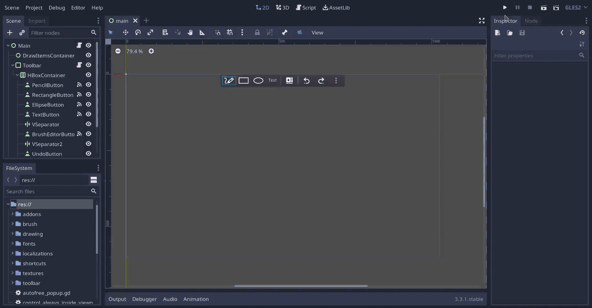

# Draw Over
Drawing application with support for transparent background, working both as a
drawing board or on-screen annotation tool.

Made with [Godot](https://godotengine.org/).

## Credits
- Undo, Redo, Context Menu and Color Palette icons from Material Design Icons: https://github.com/Templarian/MaterialDesign
- Droid Sans font from the Android Open Source Project

